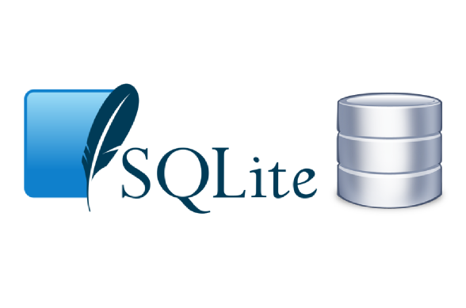

# SQLite

 Overview of SQLite SQLite is a lightweight, serverless, self-contained, and transactional SQL database engine. It is embedded directly into the applications that use it, rather than running as a separate server process. SQLite is widely used in various applications, from mobile apps to embedded systems, due to its small footprint and ease of use. 

 

 